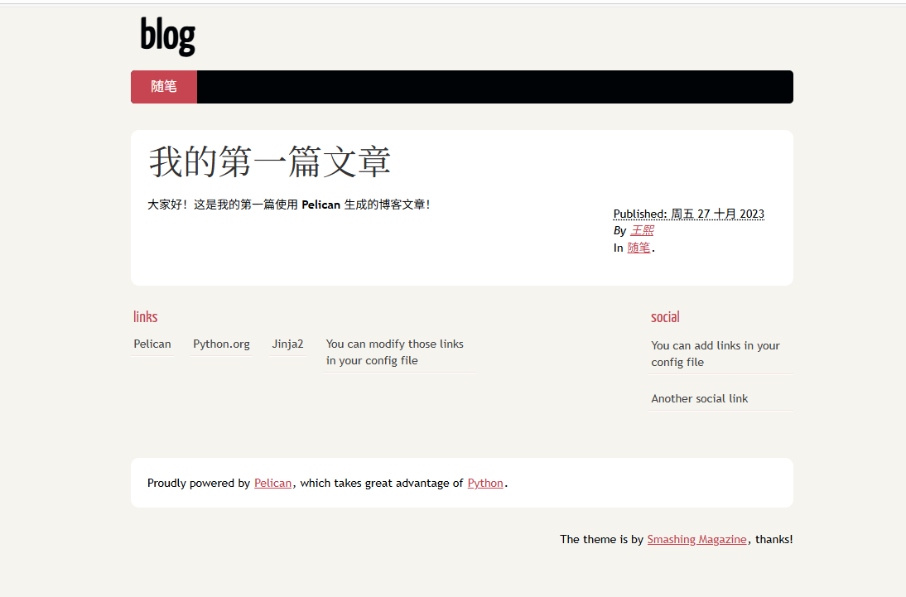

# serverless个人博客搭建
## 为什么选择serverless？
- 可行性：个人博客不需要太复杂的逻辑处理，静态页面就可以搞定
- 降本：相比于前后端架构，静态页面的成本非常低
- 增效：相比于服务器，不需要复杂的运维工作就可以保证可用性
## 技术选型
- **serverless部署选择**:

| 技术   | 国内访问速度 | 成本    | 是否选择 | 说明                                                                                                                                                               |
|------|--|-------|--|------------------------------------------------------------------------------------------------------------------------------------------------------------------|
| 云函数  | 快 | 低     |  | 不需要复杂处理                                                                                                                                                          |
| GitHub Pages | 慢 | 无     |  | 用户体验拉跨                                                                                                                                                           |
| Vercel/Netlify | 中 | 小体量免费 |  | 1、国内访问速度这一块褒贬不一 2、开发体验好，有配套的CI/CD 3、可以配置额外的CDN国内加速解决访问速度慢的痛点                                                                                               |
| 对象存储 | 快 | 低 | | 1、国内站点不能直接访问html，而是会下载，需要配置自定义域名 2、配置自定义域名访问国内站点需要备案，但对象存储本身不属于可以备案的资源，所以得买服务器 3、可以使用香港或者境外节点解决无法直接访问以及自定义域名备案问题 4、如果选择了境外站点，可以通过配置额外的CDN国内加速解决访问速度慢的痛点 |

- **网站页面**：

| 技术类型 | 是否选择 | 说明                                                           |
|--|--|--------------------------------------------------------------|
| 前端技术 | ❌ | 我不会前端（                                                       |
| pelican | ❌ | 生成的页面不太喜欢，而且感觉比较复杂，我已经设置了中文，但是页面还是英文的  |
| mkdocs | ✅ | 操作简单，自由度高，能生成符合我审美的页面，还能在本地调试                                |

